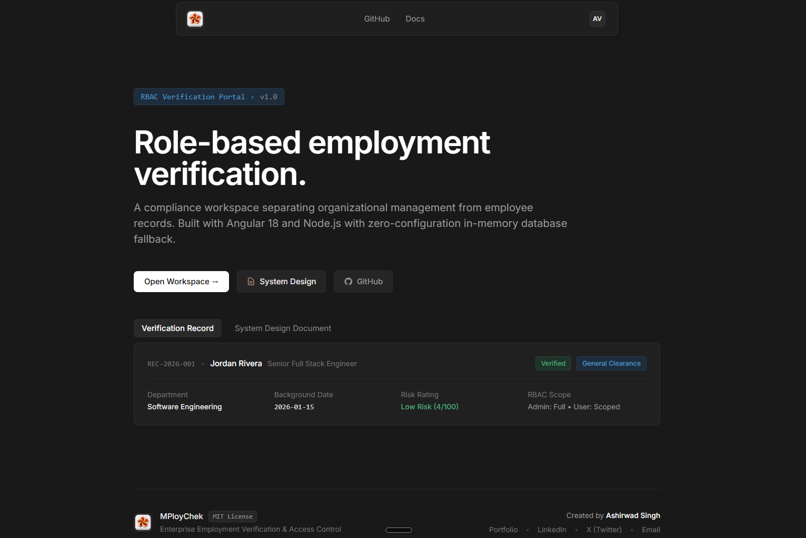

# MPloyChek



A role-based employment verification portal built with Angular 18 and a Node.js Express backend. It separates access between administrators and standard employees, backed by MongoDB with an automatic fallback to an embedded in-memory database when no database URL is set.

---

## System design & architecture

For an in-depth breakdown of the architecture, data modeling, RBAC security boundaries, and asynchronous latency injection, see the dedicated specification:

📄 **[System Design Specification (system-design.md)](./system-design.md)**

### High-level architecture

MPloyChek consists of three layers:

1. **Frontend (Angular 18)**: A standalone single-page application using Angular Signals for state management and functional HTTP interceptors for JWT token handling and error reporting.
2. **Backend (Node.js & Express)**: A TypeScript REST API structured around controllers, services, and repositories, with Zod for request validation.
3. **Database (MongoDB)**: Mongoose schemas store users and verification records. If no `MONGO_URI` is provided, the backend starts an embedded in-memory MongoDB instance and seeds demo data on boot.

---

## Features

- **Role-based access control**: Administrators can inspect organizational records, sensitive compensation tiers, risk scores, and audit notes. General users can only view their own verification records.
- **Records directory**: Search and filter employment records by candidate name, department, clearance level, and verification status.
- **User management**: Dedicated administrator view to create users, update roles, toggle active status, and delete accounts.
- **Zero-config database**: Boots out of the box without installing MongoDB or Docker. Seed data is inserted automatically.
- **Docker support**: Single-command startup with multi-container Docker Compose.

---

## Test accounts

The login screen includes one-click buttons to populate these accounts:

| Role | User ID / Email | Password | Access scope |
| :--- | :--- | :--- | :--- |
| Administrator | `admin@mploychek.com` | `Password@123` | Full organization records, audit notes, compensation grades, and user management. |
| General User | `user@mploychek.com` | `Password@123` | User-scoped records only. Sensitive compensation and risk fields are excluded. |

---

## Getting started

### Prerequisites

- Node.js 20 or higher
- npm 9 or higher
- Docker (optional)

---

### Option 1: Quick start (no MongoDB or Docker required)

From the project root:

```bash
# 1. Install dependencies for root, backend, and frontend
npm run install:all

# 2. Start backend and frontend together
npm run dev
```

The frontend runs at `http://localhost:4200` and the API runs at `http://localhost:3000`.

---

### Option 2: Docker Compose

If you have Docker installed, start the entire stack including a dedicated MongoDB container:

```bash
docker compose up --build
```

- Web application: `http://localhost:4200`
- Backend API: `http://localhost:3000`
- MongoDB: `localhost:27017`

---

### Option 3: Manual startup

#### Backend

```bash
cd backend
npm install
npm run build
npm start
```

#### Frontend

```bash
cd frontend
npm install
npm run build
npm start
```

---

## Environment variables

To connect an external MongoDB instance, create a `.env` file in the `backend/` directory:

```env
PORT=3000
NODE_ENV=development
JWT_SECRET=mploychek-production-grade-jwt-secret-key-2026
JWT_EXPIRES_IN=8h

# Optional. If omitted, MPloyChek runs an embedded in-memory MongoDB database.
MONGO_URI=mongodb://localhost:27017/mploychek
```

To re-seed an external database at any time, run:

```bash
cd backend
npm run seed
```

---

## License

Distributed under the [MIT License](LICENSE). See `LICENSE` for more information.

---

## Author

**Ashirwad Singh**

- Portfolio: [https://www.aash7.xyz/](https://www.aash7.xyz/)
- LinkedIn: [https://www.linkedin.com/in/ashirwad08singh/](https://www.linkedin.com/in/ashirwad08singh/)
- X (Twitter): [https://x.com/ashirwadsingh_](https://x.com/ashirwadsingh_)
- Email: [singhashirwad2003@gmail.com](mailto:singhashirwad2003@gmail.com)
