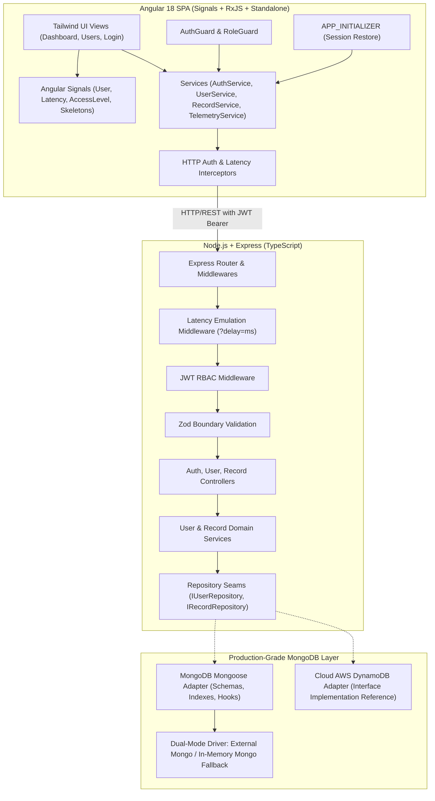

# MPloyChek: Production-Grade Angular & Node.js SPA Architecture Plan

## 1. Executive Summary
**MPloyChek** is an enterprise-grade Single Page Application (SPA) built with **Angular 18** (Standalone Components, Signals, RxJS) and a **Node.js/TypeScript** backend with **MongoDB** (production-grade Mongoose ODM with dual-mode support: local MongoDB instance or automated zero-config in-memory MongoDB fallback). It delivers strict Role-Based Access Control (RBAC) across two core roles: **General User** and **Admin**.

This plan strictly fulfills all evaluation criteria:
- **Effective use of Angular framework & libraries**: Standalone components, modern Angular Signals, RxJS reactive observable pipelines, `APP_INITIALIZER` session restoration, custom HTTP interceptors (JWT auth + delay injection + telemetry tracking), multi-tier route guards (`AuthGuard`, `RoleGuard`), reactive forms with Zod/custom validators.
- **Knowledge of API & cloud framework**: Layered clean architecture (Controller-Service-Repository), production Mongoose schemas with compound indexes, automated seeding, dual-mode MongoDB connection, AWS DynamoDB cloud adapter reference, JWT token authentication, and simulated network latency engine (`?delay=ms`).
- **UI & Creative Design**: Bespoke design with Tailwind CSS, live telemetry visualizer displaying the async lifecycle (Request Dispatched &rarr; Latency Simulation &rarr; Server Processing &rarr; Stream Delivery &rarr; DOM Render), skeleton loading states, role-aware dashboard, and user management CRUD console for Admins.
- **Zero GitHub boilerplates/slop**: Clean, hand-crafted code following deep-module design principles and strict TypeScript guidelines.

---

## 2. Architecture & Seam Design



### Deep Module Seams:
1. **Repository Seam (`IRepository<T>`)**: Callers only deal with domain entities (`User`, `EmployeeRecord`). The storage layer uses Mongoose with compound indices, schema validation, and dual-mode connection (connects to local `mongodb://localhost:27017` or seamlessly spawns an isolated in-memory Mongo instance if a local daemon is absent).
2. **Telemetry & Delay Seam**: Express middleware intercepts requests, extracts `delay` parameter (via query `?delay=2000` or header `X-Simulated-Delay`), sleeps asynchronously using cancellable timers, and emits latency headers (`X-Simulated-Delay`, `X-Response-Time`).
3. **Frontend Telemetry Pipeline**: Angular HTTP interceptor measures round-trip time, tracks pending async requests in real time, and feeds an interactive latency and async telemetry visualizer.

---

## 3. Technology Stack

| Layer | Technology | Justification |
|-------|------------|---------------|
| **Frontend Framework** | Angular 18 (Standalone Components + Signals + RxJS) | Confirmed by user. Modern Angular standard, eliminating NgModule overhead while maintaining structured dependency injection and high performance. |
| **State Management** | Angular Signals + RxJS Declarative Observables | Reactive state with zero external library bloat; fine-grained change detection and effortless async pipe binding. |
| **CSS / Styling** | Tailwind CSS + Lucide Icons / Heroicons | Custom, sleek UI without generic Bootstrap components; custom glassmorphism panels, dark/light themes, and animated skeletons. |
| **Backend Runtime** | Node.js (v22.19.0) + TypeScript (TSX/tsc) | Strongly typed end-to-end; shared DTO definitions between client and server. |
| **Web Server** | Express.js + CORS + Helmet + Morgan | Industry-standard Node HTTP framework with robust middleware ecosystem. |
| **Validation** | Zod | Runtime boundary validation on both frontend forms and backend REST requests; zero runtime type drift. |
| **Database** | MongoDB (Mongoose ODM with Dual-Mode Engine) | Confirmed by user. Production-grade Mongoose schemas with compound indexes, timestamps, validation hooks, and automated seeding. |
| **Cloud Framework Reference** | AWS DynamoDB SDK v3 Adapter | Demonstrates multi-cloud persistence knowledge and enables 1-line environment variable switching. |

---

## 4. Key Functional Features

### 4.1 Login & Authentication
- **Inputs**: User ID (username/email), Password, and Target Role selector ("General User" | "Admin").
- **Security**: Passwords hashed with `bcryptjs`, JWT signed tokens (access token + refresh token simulation), Bearer header handling.
- **Pre-seeded Accounts**:
  - `admin@mploychek.com` / `Admin@123` &rarr; Role: **Admin**
  - `user@mploychek.com` / `User@123` &rarr; Role: **General User**
  - Plus quick-fill selector buttons on login card for hassle-free evaluation.

### 4.2 User Management (Admin Exclusive)
- **RBAC Guarding**: Non-admin users attempting to access `/admin/users` or calling `GET/POST/PUT/DELETE /api/users` receive a 403 Forbidden with toast notification.
- **Admin Capabilities**:
  - User Directory Table with search, role filter, and status filter (Active/Suspended).
  - Add New User modal (User ID, Name, Email, Role, Department).
  - Role toggling (instantly promote/demote between General User and Admin).
  - Reset password / change account status (Active / Inactive).
  - Audit trail logging user changes.

### 4.3 Logged-In User Dashboard & Records Table
- **User Profile Header**: Displays user avatar, badge for role ("Admin" with golden badge, "General User" with blue badge), last login timestamp, and session telemetry.
- **Records Table (RBAC Access Level Demonstration)**:
  - **General User View**: Sees their personal employment records, assigned assets, performance reviews, and public department announcements. Sensitive fields (e.g., compensation tier, internal audit notes, employee SSN/Gov ID) are masked/omitted both in backend API response and UI table.
  - **Admin View**: Sees all organizational records across all departments with full administrative columns (Salary Grade, Confidential Risk Score, Background Check Status, Edit/Delete action triggers).
  - **Live Filter, Search & Export**: Filter by category, status, and instant text search.

### 4.4 Async Processing & Delay Mechanism Showcase
- **Configurable Delay Parameter**:
  - Users/Evaluators can adjust a delay dropdown or slider directly in the UI header (`0ms`, `500ms`, `1500ms`, `3000ms`, `5000ms`, or custom).
  - The parameter is appended to all API calls (e.g., `GET /api/records?delay=2000`).
- **Showcased Async UX Features**:
  - **Skeleton Screens**: Shimmering placeholder table and card skeletons instead of jarring layout shifts.
  - **Live Request Lifecycle Visualizer**: Displays `Idle` &rarr; `Request Dispatched` &rarr; `Server Delay Simulating (Progress Bar)` &rarr; `Response Received & Decoded` &rarr; `View Rendered`.
  - **Cancel In-Flight Request**: Ability to cancel a delayed request via RxJS `takeUntil` / `AbortController` and see graceful handling.
  - **Retry Mechanism**: Exponential backoff or manual retry button on simulated error or delay timeout.

### 4.5 Modular Architecture & App Bootstrapping
- **`APP_INITIALIZER`**: Validates stored session on page refresh before Angular renders routes, avoiding flicker or unwanted redirects.
- **`UserService` & `RecordService`**: Modular services encapsulating data access, caching, and state updates.
- **Angular HTTP Interceptors**:
  - `AuthInterceptor`: Injects `Authorization: Bearer <token>` to outbound requests.
  - `DelayInterceptor`: Injects the selected latency parameter from state.
  - `ErrorInterceptor`: Centralized error logging, token expiration handling, and toast notifications.

---

## 5. Project Directory Structure

```
MPloyChek/
├── backend/
│   ├── src/
│   │   ├── config/             # DB and environment configuration
│   │   ├── controllers/        # Auth, User, Record controllers
│   │   ├── db/                 # MongoDB schemas, Mongoose connection, seed data
│   │   ├── middleware/         # Auth JWT, RBAC, Delay simulator, Error handler
│   │   ├── repositories/       # IUserRepository, MongoUserRepository, DynamoUserRepository
│   │   ├── routes/             # Express route declarations
│   │   ├── services/           # Business logic & hashing
│   │   ├── types/              # Domain interfaces, DTOs, Zod schemas
│   │   └── server.ts           # Express server entry point
│   ├── package.json
│   └── tsconfig.json
├── frontend/
│   ├── src/
│   │   ├── app/
│   │   │   ├── core/           # Guards, Interceptors, AppInitializer, Models
│   │   │   ├── services/       # AuthService, UserService, RecordService, TelemetryService
│   │   │   ├── shared/         # Skeletons, Modal, Toast, DelaySelector, Navbar
│   │   │   ├── features/
│   │   │   │   ├── auth/       # Login component, Role switcher
│   │   │   │   ├── dashboard/  # Logged-in page, User profile, Records table
│   │   │   │   └── admin/      # User management CRUD module
│   │   │   ├── app.routes.ts
│   │   │   └── app.component.ts
│   │   ├── assets/
│   │   ├── index.html
│   │   └── styles.css          # Tailwind CSS styles
│   ├── package.json
│   ├── tailwind.config.js
│   └── tsconfig.json
├── plan.md                     # This plan
└── README.md                   # Full run instructions & architectural documentation
```

---

## 6. Implementation Steps

1. **Step 1: Backend Scaffolding & MongoDB Persistence Layer**
   - Initialize `backend/` with TypeScript, Express, Mongoose, `mongodb-memory-server` (fallback), Zod, JWT, bcryptjs.
   - Configure dual-mode DB connection: attempts local MongoDB first, smoothly falls back to in-memory instance if daemon is offline.
   - Define Mongoose schemas for `User` and `Record` with indexes and seed defaults (`admin@mploychek.com`, `user@mploychek.com`, plus 10 realistic employee audit records).
2. **Step 2: Backend REST APIs & Latency Middleware**
   - Implement `delayMiddleware` supporting `?delay=<ms>` query param and `X-Simulated-Delay` header.
   - Implement `authMiddleware` with JWT validation and RBAC role assertion.
   - Implement Auth routes (`/api/auth/login`, `/api/auth/me`).
   - Implement Record routes (`/api/records`) with role-scoped projection (sensitive fields filtered for General User).
   - Implement Admin User CRUD routes (`/api/users`).
3. **Step 3: Frontend Scaffolding (Angular 18 + Tailwind)**
   - Initialize `frontend/` using Angular CLI (standalone components enabled).
   - Configure Tailwind CSS for modern aesthetics (glassmorphic cards, gradients, badges).
4. **Step 4: Frontend Core Infrastructure**
   - Implement `APP_INITIALIZER` to restore logged-in state before route activation.
   - Implement `AuthInterceptor` (JWT bearer injection) and `DelayInterceptor` (delay param injection).
   - Implement `AuthGuard` and `RoleGuard` (protecting admin routes).
   - Build reactive state services (`AuthService`, `UserService`, `RecordService`, `TelemetryService`) utilizing Angular Signals and RxJS observables.
5. **Step 5: Frontend Views & Interactive Showcase**
   - **Login Page**: User ID, Password, and Role selection with instant 1-click test credential fill.
   - **Dashboard (Logged In Page)**:
     - User detail profile banner with role badge and session statistics.
     - Interactive API delay control bar (0ms, 500ms, 1500ms, 3000ms, 5000ms).
     - Live async request telemetry visualizer.
     - Shimmering table skeleton loaders during delay.
     - Records table showing access-level differences between General User and Admin.
   - **Admin User Management**:
     - User directory table with role toggles, status updates, and user addition modal.
6. **Step 6: End-to-End Verification & Documentation**
   - Verify all workflows: Login as User, observe restricted records; Login as Admin, observe unrestricted records and user management.
   - Test async delay simulation and skeleton transitions.
   - Provide complete run commands and testing guide in `README.md`.
