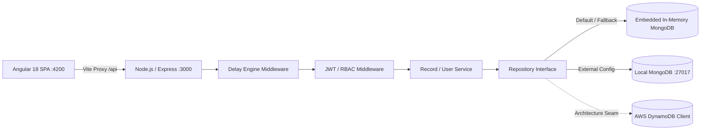

# MPloyChek — Technical System Design

> Role-based employment verification engine built with Angular 18 and Node.js/TypeScript featuring query-level field projection and parameterized latency simulation.

---

## 1. Problem Statement

Multi-tier employment background checks contain sensitive data (compensation grades, risk ratings, audit comments) alongside public employee records. Exposing unrestricted payloads or filtering fields on the client leaks confidential records through browser network inspectors. MPloyChek enforces field-level security at the database driver layer and models variable API latencies.

---

## 2. Goals & Non-Goals

### Goals
- Enforce server-side Role-Based Access Control (RBAC) across `Admin` and `General User` scopes.
- Project confidential attributes out of queries before serialization for non-admin callers.
- Implement parameterized network delay simulation (`?delay=ms`) without blocking the Node.js event loop.
- Deliver zero-dependency local execution via embedded in-memory MongoDB with automated state seeding.
- Isolate data access behind repository interfaces to allow swapping storage backends (MongoDB, DynamoDB, XML).

### Non-Goals
- Third-party OAuth2/OIDC identity provider integration.
- Document/PDF binary upload storage pipelines.
- Distributed session clustering across multiple physical Node instances.

---

## 3. High-Level Design (HLD)



### Component Flow
1. **Frontend (`localhost:4200`)**: Standalone Angular components communicate through Angular `HttpClient`. Vite reverse-proxies `/api/*` to `http://localhost:3000`.
2. **Delay Engine**: Global middleware extracts `?delay=<ms>` and holds request processing via non-blocking Promise timers before invoking route controllers.
3. **Authentication & RBAC**: JWT Bearer token validated via `authenticateJWT`. `requireRole('Admin')` blocks unauthorized routes.
4. **Data Access Layer**: Repositories execute Mongoose projections based on caller credentials.

---

## 4. Backend Implementation & Storage Strategy

### Why Embedded In-Memory MongoDB Over External MongoDB Alone
The assignment permitted Local XML, MongoDB, or AWS DynamoDB. Relying solely on a running external MongoDB daemon (`mongodb://localhost:27017`) breaks instant local execution if the host machine lacks MongoDB installed or active.

**Implemented Architecture: Dual-Mode Persistence with Repository Seams**
- **Primary Driver**: Mongoose ODM with automated fallback to `mongodb-memory-server`.
- **Connection Logic ([`connection.ts`](file:///C:/Users/singh/Desktop/Dev/Web-2/assignments/MPloyChek/backend/src/db/connection.ts))**:
  ```ts
  try {
    await mongoose.connect(config.mongoUri, { serverSelectionTimeoutMS: 2000 });
  } catch {
    const memoryServer = await MongoMemoryServer.create();
    await mongoose.connect(memoryServer.getUri());
  }
  ```
- **Storage Portability**: Services consume `IUserRepository` and `IRecordRepository`. The codebase contains [`DynamoUserRepositoryRef`](file:///C:/Users/singh/Desktop/Dev/Web-2/assignments/MPloyChek/backend/src/repositories/user.repository.ts), demonstrating how DynamoDB SDK v3 drops in by fulfilling the exact same interface without modifying controllers.

### Local Database Seeding ([`seed.ts`](file:///C:/Users/singh/Desktop/Dev/Web-2/assignments/MPloyChek/backend/src/db/seed.ts))
On database connection, the bootloader runs `seedDatabase()` if collections are empty:
- **5 User Accounts**: Pre-hashed with `bcrypt` (cost factor 10), provisioning 2 Admins and 3 General Users across Engineering, Cloud, Product, and HR.
- **10 Verification Records**: Spanning 3 access tiers (`General`, `Confidential`, `Executive`). Sensitive fields populated: `compensationGrade`, `riskScore` (1–100), `auditNotes`, and masked IDs (`XXX-XX-####`).

---

## 5. API Routes & Delay Query Parameter

All endpoints accept `?delay=<ms>` (clamped between `0` and `10000` ms). The delay middleware executes:
```ts
const delay = Math.min(10000, Math.max(0, parseInt(req.query.delay as string, 10)));
if (delay > 0) await new Promise((resolve) => setTimeout(resolve, delay));
```

### Route Table

| Method | Endpoint | Auth | Description |
|---|---|---|---|
| `GET` | `/api/health` | None | Verifies API runtime and active database mode (Local vs In-Memory). |
| `POST` | `/api/auth/login?delay=ms` | None | Validates credentials, verifies role matches DB record, returns signed JWT. |
| `POST` | `/api/auth/register?delay=ms` | None | Creates user, hashes password, auto-provisions verification record, returns JWT. |
| `GET` | `/api/auth/me` | Bearer | Returns currently authenticated user context. |
| `GET` | `/api/records?delay=ms` | Bearer | Returns records based on role (full vs projected). |
| `GET` | `/api/users?delay=ms` | Admin | Returns all registered platform users. |
| `POST` | `/api/users?delay=ms` | Admin | Creates new platform user in database. |
| `PATCH` | `/api/users/:id?delay=ms` | Admin | Modifies user role, department, or active/disabled status. |
| `DELETE` | `/api/users/:id?delay=ms` | Admin | Permanently removes user account from database. |

---

## 6. Frontend Implementation & State Architecture

### State Management: Angular 18 Signals
The frontend replaces bulky NgRx store patterns and RxJS subscriptions with native reactive primitives:

- **Auth State ([`AuthService`](file:///C:/Users/singh/Desktop/Dev/Web-2/assignments/MPloyChek/frontend/src/app/core/services/auth.service.ts))**:
  - `currentUser = signal<IUser | null>(getStoredUser())`
  - `isAuthenticated = computed(() => !!this.currentUser())`
  - `isAdmin = computed(() => this.currentUser()?.role === 'Admin')`
  - Session bootstrap via `APP_INITIALIZER` (`restoreSession()`) validates cached tokens against `/api/auth/me` before routes render.

- **Dashboard Filtering ([`DashboardComponent`](file:///C:/Users/singh/Desktop/Dev/Web-2/assignments/MPloyChek/frontend/src/app/features/dashboard/dashboard.component.ts))**:
  - `searchQuery = signal<string>('')`
  - `selectedStatus = signal<string>('All')`
  - `selectedAccessLevel = signal<string>('All')`
  - `filteredRecords = computed(() => ...)` evaluates reactively on any signal write with zero zone-change overhead.

### HTTP Interceptors
- **`authInterceptor`**: Extracts token from `AuthService` and appends `Authorization: Bearer <token>` to all outgoing `/api/*` calls. Handles HTTP 401 by triggering session eviction and navigation to `/login`.
- **`delayInterceptor`**: Reads current delay setting from `DelayService` signal and injects `?delay=<ms>` query parameters onto API requests dynamically.

---

## 7. Data Models & Schemas

### User Entity
```typescript
interface IUser {
  _id: string;
  userId: string;       // Indexed, unique email / username
  name: string;
  role: 'General User' | 'Admin';
  department: string;
  status: 'Active' | 'Disabled';
  passwordHash?: string;
  lastLoginAt?: Date;
  createdAt: Date;
  updatedAt: Date;
}
```

### Verification Record Entity
```typescript
interface IEmployeeRecord {
  _id: string;
  recordId: string;     // Unique tracking code, e.g. REC-2026-001
  userId: string;       // Foreign key mapping to candidate identity
  employeeName: string;
  department: string;
  position: string;
  accessLevel: 'General' | 'Confidential' | 'Executive';
  verificationStatus: 'Verified' | 'Pending Review' | 'Flagged';
  backgroundCheckDate: string;
  // Field-level restricted columns (Admin-only projection):
  compensationGrade?: string;
  riskScore?: number;
  auditNotes?: string;
  govIdMasked?: string;
  createdAt: Date;
  updatedAt: Date;
}
```

---

## 8. Field-Level Query Projection Implementation

Restricting confidential data occurs directly in the database driver:

```typescript
// backend/src/repositories/record.repository.ts
async findForUser(userId: string, role: UserRole): Promise<RecordDocument[]> {
  if (role === 'Admin') {
    return RecordModel.find().sort({ createdAt: -1 }).exec();
  }

  // General users receive only their own records with sensitive fields omitted
  return RecordModel.find({ userId: userId.toLowerCase().trim() })
    .select('-riskScore -auditNotes -compensationGrade')
    .sort({ createdAt: -1 })
    .exec();
}
```
This guarantees unauthorized fields are never extracted from storage or transmitted across the wire.

---

## 9. Failure Handling & Edge Cases

| Scenario | Component | Resolution |
|---|---|---|
| MongoDB daemon offline | Database connection | Catches socket timeout and spins up in-memory MongoDB replica. |
| Backend service down | Frontend HTTP | Interceptor traps status 0 / `ECONNREFUSED` and outputs diagnostic restart instructions. |
| Role spoofing at login | Auth Controller | Compares user-selected role with database `user.role`; rejects with HTTP 403 on mismatch. |
| Simulated high latency | Frontend UI | Disables duplicate form submits and displays loading spinner with active millisecond counter. |
| Expired session | Auth Interceptor | Traps HTTP 401, clears localStorage keys, redirects to `/login?returnUrl=...`. |

---

## 10. Technical Critique: Production Improvements

If extending this system for large-scale enterprise deployment:
1. **Token Invalidation**: Replace stateless JWTs with Redis-backed revocation lists to immediately invalidate sessions when an admin sets `status: 'Disabled'`.
2. **Distributed Storage Migration**: Migrate to Amazon DynamoDB using single-table design (`PK=USER#<id>`, `SK=RECORD#<id>`) to eliminate Mongoose schema overhead and guarantee sub-10ms query times at scale.
3. **Database Field Encryption**: Apply envelope encryption (AWS KMS / Tink) to store `govIdMasked` and `compensationGrade` encrypted at rest, preventing leakage during direct database dumps.
4. **Automated Integration Testing**: Add Supertest suites for endpoint delay validation and Vitest suites for Angular signal computations.
